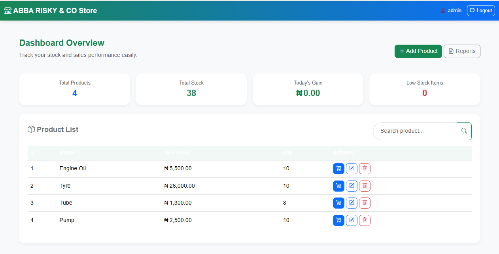

# # 🛍️ Store Management System

A web application that helps store owners **manage sales, inventory, and daily reports** through an interactive dashboard.

---

## 🧠 Tech Stack
HTML | CSS | JavaScript | Bootstrap | PHP | MySQL

---

## ✨ Features
- Dashboard with sales and inventory overview
- Product CRUD (Create, Read, Update, Delete)
- Transaction logging and basic reports
- Responsive layout for mobile and desktop

---

## ⚙️ How to Run (local)
1. Clone the repo: `git clone https://github.com/YourUsername/store-management-system.git`
2. If using XAMPP/WAMP, place the folder in `htdocs` or `www`.
3. Import `database.sql` (if included) into phpMyAdmin.
4. Open `http://localhost/store-management-system/`

---

## 📸 Screenshots

---

## 📄 License
For learning and portfolio use.
